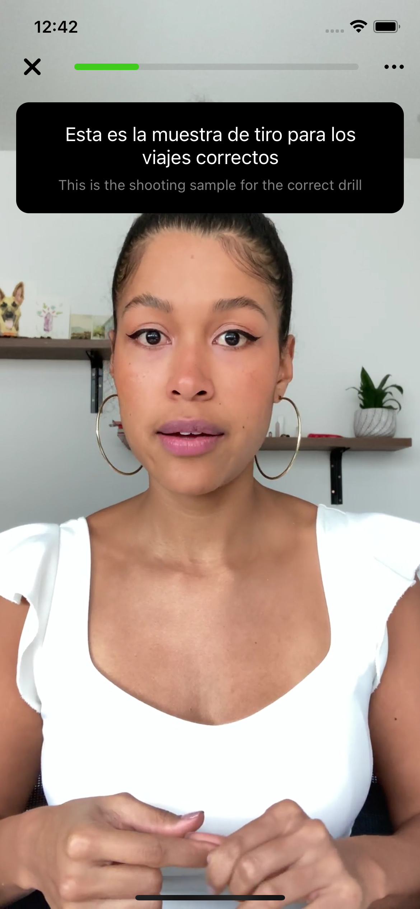

<h1 align="center">Benjamin Arko Afrasah Coding Challenge</h1>

<div align="center">
   Solution for a challenge from  <a href="https://docs.google.com/document/d/1APQj27ZzJmMKqOIxmZa78c38O0dmGMn95JLaREHOuRE/edit" target="_blank">FluentU coding exercise Question</a>.
</div>

<div align="center">
  <h3>
   <a href="https://docs.google.com/document/d/1q04HgePLqWlIXHQwcrjWZAvTdUEk3EwO0P30Oy4YJx4/edit">
      Solution
    </a>
    <span> | </span>
    <a href="https://drive.google.com/file/d/1AJJ5dDlpNp5V6HddMQP-QKjEqpnXxNvH/view?usp=sharing">
      Correct Sample Demo
    </a>
    <span> | </span>
   <a href="https://drive.google.com/file/d/12_Ybpu8G--AJDRt0BS28cn3fOgyjTL9U/view?usp=sharing">
      Incorrect Sample Demo
    </a>
    <span>
  </h3>
</div>

<!-- TABLE OF CONTENTS -->

## Table of Contents

-   [Overview](#overview)
    -   [Built With](#built-with)
-   [Features](#features)
-   [How to use](#how-to-use)

<!-- OVERVIEW -->

## Overview

<span>



</span>


### Built With

<!-- This section should list any major frameworks that you built your project using. Here are a few examples.-->

-   [React-Native](https://reactnative.dev/docs/getting-started)
-   [Speech Recognition](https://github.com/react-native-voice/voice)
-   [Video Player](https://github.com/react-native-video/react-native-video)


## How To Use

<!-- Example: -->

To clone and run this application, you'll need [Git](https://git-scm.com) and [Node.js](https://nodejs.org/en/download/) (which comes with [npm](http://npmjs.com)) installed on your computer. From your command line:

```bash
# Clone this repository
$ git clone https://github.com/Silvrash/FluentU-Interview.git

$ cd FluentU-Interview

$ yarn

$ cd ios && pod install && cd ..

$ yarn ios
```